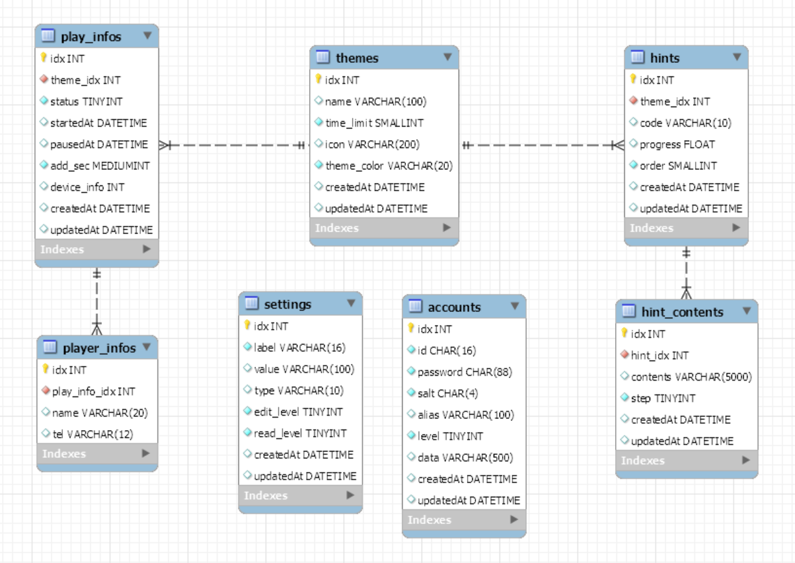

# ROOM ESCAPE HINT SYSTEM - **SERVER**

<details>
<summary>
    <b>중요 안내 - 한국어 버전</b>
</summary>

> ⚠️ 이 프로젝트는 오직 서버사이드 시스템만 포함한다는 사실을 양지해주십시오. **클라이언트 코드는 외부에 공개되지 않습니다**

> 누구나 이 프로제트의 코드를 자유롭게 사용할 수 있습니다. repository를 fork하거나, 코드를 수정하는 것은 완전히 허용됩니다. 그러나, 코드 수정 여부와 관련 없이, 이 프로젝트를 그 자체로 영리적인 목적으로 이용하는 것은 **절대** 불허합니다.
>
> 예를 들어, 아래의 예시들은 허용됩니다.
>
> -   ✅ 이 프로젝트를 이용한 시스템을 매장에 무상으로 제공
> -   ✅ 본인의 매장에서 본 프로젝트를 활용한 시스템 사용
>
> 반면에, 아래에 제시된 사례들은 **절대** 금지합니다.
>
> -   🚫 본 프로젝트를 이용한 시스템을 금전적인 대가를 받고 판매
> -   🚫 이 프로젝트를 영리적인 목적의 SaaS로 변형
>
> 금지된 사례에 해당하는 경우가 적발될 시 강력한 법적 제재를 가할 것입니다. 지적재산권을 존중해주시기를 정중히 부탁드리겠습니다.
>
> 물론, 금지된 사례를 포함하여, 어떤 경우든 사용에 대한 허락을 묻는 것은 괜찮습니다.
> 이메일로 연락주십시오: fainthit@kakao.com
>
> 또한 이 프로젝트에 자유롭게 Pull Request를 생성해주세요! 감사합니다. 🤗
>
> (추신: 이 프로젝트 사용에 대한 권한을 금전적으로 판매하지 않습니다.)

</details>
<br>

> ⚠️ Please note that this project contains only the serverside system. **The client code is not opened in the public.**

> Anyone can freely use the code for this project. It is completely acceptable to fork the repository, or modify the code. However, I **absolutely** prohibit the use of this project for commercial purposes, regardless of whether the code is modified or not.
>
> For example, the cases below allow.
>
> -   ✅ Using this project for free to provide the system to stores
> -   ✅ Using the system using this project in your store
>
> On the other hand, the following cases are **absolutely** prohibited.
>
> -   🚫 Selling the system using this project at a financial price
> -   🚫 Transforming this project into a commercial form of SaaS
>
> I will impose strong legal sanctions if caught in a prohibited case. I ask you kindly to respect intellectual property rights.
>
> Of course, it's okay to ask me about use in any case, including any prohibited cases.
> Please contact me by email: fainthit@kakao.com
>
> And please feel free to create a PR on this project! Thanks. 🤗
>
> (PS: I won't sell any permission monetarily to use this code.)

## Project Informations

| Current Version |
| --------------- |
| 0.1.0           |

## Database Diagram

> ℹ️ You can access to the database dump at `/mysql/dumps/`



> Diagram updated version: **0.1.0**.
> Please check again with database dump if it's different with the current version. I might forgot to update it.

## Tech Stack

| framework  | Socket    | Database |
| ---------- | --------- | -------- |
| Express.js | Socket.io | MySQL    |

## GitIgnored Files

-   `/app/public/upload/`(Required)

    > A directory for uploading files.

-   `/.env`(Required)

    > An environment file

    ```
    HINTSYS_PORT={MAIN_SYSTEM_OUT_PORT}
    MYSQL_ROOT_PASSWORD={MYSQL_ROOT_PASSWORD}
    MYSQL_PORT={MYSQL_OUT_PORT}
    ```

-   `/app/lib/security/encryptPw.js`(Optional)

    > Without this file, the passwords will be stored as plain text.

    ```javascript
    module.exports = async (str, salt) => {
        //Hashing codes here
        return hash;
    };
    ```

## Document

### Objects

<a name="theme-object"></a>

<details>
<summary>
<code><b>Theme</b></code>
<code>(Theme preview info)</code>
</summary>

##### Theme

> | key         | description                               | type   | default  |
> | ----------- | ----------------------------------------- | ------ | -------- |
> | idx         | The identified number of the theme        | Int    |          |
> | name        | The name or the title of the theme        | String |          |
> | time_limit  | The theme's limit time in minutes         | Int    | `60`     |
> | icon        | The theme's icon image URL                | String |          |
> | theme_color | Common CSS color of the theme point color | String | `'#000'` |
> | createdAt   | When the theme has been created           | Date   |          |
> | updatedAt   | When the theme has been updated at last   | Date   |          |

</details>
<a name="play_info-object"></a>
<details>
<summary>
<code><b>Play_info</b></code>
<code>(Each playing simple information)</code>
</summary>

##### Play_info

> | key         | description                                                      | type | default |
> | ----------- | ---------------------------------------------------------------- | ---- | ------- |
> | idx         | The identified number of the playing info                        | Int  |         |
> | theme_idx   | The linked theme idx                                             | Int  |         |
> | status      | Theme playing status                                             | Int  | `0`     |
> | startedAt   | The exact time of the start playing. `Null` when `status` is `0` | Date |         |
> | pausedAt    | The exact time of the last pausing.                              | Date |         |
> | add_sec     | Seconds will be added to the total playing time.                 | Int  |         |
> | device_info | The socket id of the connected hint device.                      | Int  |         |
> | createdAt   | When the data has been created                                   | Date |         |
> | updatedAt   | When the data has been updated at last                           | Date |         |

-   <details>
      <summary><b>Playing status value table</b></summary>

    > ℹ️ Negative numbers mean 'cannot access to the device'.
    > | Value | meaning |
    > | ----- | ------------------------------------------ |
    > | `0` | Ready |
    > | `1` | Playing |
    > | `2` | Paused |
    > | `-1` | Ended |
    > | `-2` | Disconnected(Not sure if it would be used) |

      </details>

</details>
<a name="player_info-object"></a>
<details>
<summary>
<code><b>Player_info</b></code>
<code>(Detailed player information)</code>
</summary>

##### Player_info

> | key  | description                        | type   | default |
> | ---- | ---------------------------------- | ------ | ------- |
> | name | The name of the player             | String |         |
> | tel  | The Telephone number of the player | String |         |

</details>
<a name="hint-object"></a>
<details>
<summary>
<code><b>Hint</b></code>
<code>(A single hint information including contents)</code>
</summary>

##### Hint

> | key      | description                                                        | type   | default |
> | -------- | ------------------------------------------------------------------ | ------ | ------- |
> | idx      | The identified number of the hint                                  | Int    |         |
> | code     | Hint code                                                          | String |         |
> | progress | Progress of the hint for the whole theme (%)                       | Float  |         |
> | contents | Each element contains `idx(Int)`, `contents(String)`, `step(Int)`. | Array  |         |

</details>
<a name="account-object"></a>
<details>
<summary>
<code><b>Account</b></code>
<code>(An authentication account information)</code>
</summary>

##### Account

> | key       | description                                       | type        | default |
> | --------- | ------------------------------------------------- | ----------- | ------- |
> | idx       | Identified number of the account                  | Int         |         |
> | id        | Account ID                                        | String      |         |
> | alias     | Account alias (of course can be used as nickname) | String      |         |
> | level     | Security level                                    | Int         | 0       |
> | data      | Additional data                                   | JSON String |         |
> | createdAt | When the account has been created                 | Date        |         |
> | updatedAt | When the account has been updated at last         | Date        |         |

-   <details>
    <summary>
    <b>
    Security Level Indicator
    </b>
    </summary>

    > ℹ️ 'Allowed' informations are stored in `data` column.

    > | level | account type              | accessable area                                                                                |
    > | ----- | ------------------------- | ---------------------------------------------------------------------------------------------- |
    > | 0     | Default Account           | N/A                                                                                            |
    > | 1     | Low-Ranked Hint Device    | **readonly**: Allowed theme and hint informations                                              |
    > | 2     | High-Ranked Hint Device   | **readonly**: Every themes and hints inforations                                               |
    > | 3     | Low-Ranked Center Device  | Managing play info related to allowed themss and hints, **readonly**: Allowed themes and hints |
    > | 4     | High-Ranked Center Device | Manaing every play infos, **readonly**: Every themes and hints                                 |
    > | 5     | Low-Ranked Administrator  | Managing informations only related to allowed themes                                           |
    > | 6     | High-Ranked Administrator | Managing every informations                                                                    |
    > | 9     | Master                    | Able to access and edit every data except accounts ranked the same                             |
    > | 99    | Root                      | God                                                                                            |

    </details>

-   <details>
    <summary>
    <b>
    <code>data</code> column form
    </b>
    </summary>

    ```
    {
        "allowed": [ theme_idx1, theme_idx2, ... ]
    }
    ```

</details>
<a name="setting-object"></a>
<details>
<summary>
<code><b>Setting</b></code>
<code>(A single Configuration)</code>
</summary>

##### Setting

> | key        | description                                      | type   | default |
> | ---------- | ------------------------------------------------ | ------ | ------- |
> | label      | config label                                     | String |         |
> | value      | config value                                     | String |         |
> | read_level | The lowest account level that can read this data | Int    | 0       |
> | edit_level | The lowest account level that can edit this data | Int    | 5       |

> ℹ️ See the full configurations list at `/app/lib/settings/DefaultSettings.json`.

</details>

---

### Endpoints

> ℹ️ Every restful endpoint paths start with **`http(s)://{HOST}/api/v1`**.

#### Testing

<details>

<summary>
<code>GET</code>
<code><b>/test</b></code>
<code>(Create a new theme info with title)</code>
</summary>

##### Responses

> | http code | content-type       | response             |
> | --------- | ------------------ | -------------------- |
> | `201`     | `application/json` | `{"message": "hi!"}` |

</details>

#### Theme

<details>

<summary>
<code>POST</code>
<code><b>/theme</b></code>
<code>(Create a new theme info with title)</code>
</summary>

##### Headers

> | name              | required | data type | description                |
> | ----------------- | -------- | --------- | -------------------------- |
> | authentication-id | Y        | String    | Requires level 6 or higher |
> | authentication-pw | Y        | String    |                            |

##### Body

> | name | required | data type | description                             |
> | ---- | -------- | --------- | --------------------------------------- |
> | name | Y        | String    | The theme title (default `"New Theme"`) |

##### Responses

> | http code | content-type       | response                        |
> | --------- | ------------------ | ------------------------------- |
> | `201`     | `application/json` | `{"idx": {CREATED_DATA_IDX}}`   |
> | `401`     | `application/json` | `{"message":"Unauthorized"}`    |
> | `403`     | `application/json` | `{"message":"Low Security Lv"}` |
> | `500`     | `application/json` | `{"message":"Unknown Error"}`   |

</details>

<details>

<summary>
<code>GET</code>
<code><b>/theme/list</b></code>
<code>(Get list of the themes)</code>
</summary>

##### Headers

> | name              | required | data type | description                |
> | ----------------- | -------- | --------- | -------------------------- |
> | authentication-id | Y        | String    | Requires level 1 or higher |
> | authentication-pw | Y        | String    |                            |

##### Responses

> | http code | content-type       | response                        |
> | --------- | ------------------ | ------------------------------- |
> | `200`     | `application/json` | Array of [Theme](#theme-object) |
> | `401`     | `application/json` | `{"message":"Unauthorized"}`    |
> | `403`     | `application/json` | `{"message":"Low Security Lv"}` |
> | `500`     | `application/json` | `{"message":"Unknown Error"}`   |

</details>

<details>

<summary>
<code>PATCH</code>
<code><b>/theme/{idx}</b></code>
<code>(Update theme information except hint)</code>
</summary>

##### Headers

> | name              | required | data type | description                |
> | ----------------- | -------- | --------- | -------------------------- |
> | authentication-id | Y        | String    | Requires level 5 or higher |
> | authentication-pw | Y        | String    |                            |

##### Parameters

> | name | data type | description      |
> | ---- | --------- | ---------------- |
> | idx  | Int       | Target theme idx |

##### Body

> | name       | required | data type | description                                      |
> | ---------- | -------- | --------- | ------------------------------------------------ |
> | updateData | Y        | Object    | `{"{updatingValueKey}": "{valueToUpdate}", ...}` |

##### Responses

> | http code | content-type       | response                        |
> | --------- | ------------------ | ------------------------------- |
> | `201`     | `application/json` | `{"affectedKeys": [...]]}`      |
> | `401`     | `application/json` | `{"message":"Unauthorized"}`    |
> | `403`     | `application/json` | `{"message":"Low Security Lv"}` |
> | `500`     | `application/json` | `{"message":"Unknown Error"}`   |

</details>

<details>

<summary>
<code>GET</code>
<code><b>/theme/{idx}</b></code>
<code>(Get full informations of the theme)</code>
</summary>

##### Headers

> | name              | required | data type | description                |
> | ----------------- | -------- | --------- | -------------------------- |
> | authentication-id | Y        | String    | Requires level 1 or higher |
> | authentication-pw | Y        | String    |                            |

##### Parameters

> | name | data type | description      |
> | ---- | --------- | ---------------- |
> | idx  | Int       | Target theme idx |

##### Responses

> | http code | content-type       | response                                                           |
> | --------- | ------------------ | ------------------------------------------------------------------ |
> | `200`     | `application/json` | [Theme](#theme-object) but contains Array of [Hint](#hint-object)s |
> | `401`     | `application/json` | `{"message":"Unauthorized"}`                                       |
> | `403`     | `application/json` | `{"message":"Low Security Lv"}`                                    |
> | `500`     | `application/json` | `{"message":"Unknown Error"}`                                      |

</details>

#### Hint

<details>

<summary>
<code>POST</code>
<code><b>/hint/{theme-idx}</b></code>
<code>(Create new hint)</code>
</summary>

##### Headers

> | name              | required | data type | description                |
> | ----------------- | -------- | --------- | -------------------------- |
> | authentication-id | Y        | String    | Requires level 5 or higher |
> | authentication-pw | Y        | String    |                            |

##### Parameters

> | name      | data type | description      |
> | --------- | --------- | ---------------- |
> | theme-idx | Int       | Target theme idx |

##### Body

> | name     | required | data type | description                                           |
> | -------- | -------- | --------- | ----------------------------------------------------- |
> | code     | Y        | String    | Hintcode, the length must be shorter than 10          |
> | progress | N        | Float     | Theme progress                                        |
> | order    | N        | Int       | The order of the hint. The default order is the last. |

##### Responses

> | http code | content-type       | response                        |
> | --------- | ------------------ | ------------------------------- |
> | `201`     | `application/json` | `{"idx": {CREATED_DATA_IDX}}`   |
> | `401`     | `application/json` | `{"message":"Unauthorized"}`    |
> | `403`     | `application/json` | `{"message":"Low Security Lv"}` |
> | `500`     | `application/json` | `{"message":"Unknown Error"}`   |

</details>

<details>

<summary>
<code>PATCH</code>
<code><b>/hint/{hint-idx}</b></code>
<code>(Update the hint information except content)</code>
</summary>

##### Headers

> | name              | required | data type | description                |
> | ----------------- | -------- | --------- | -------------------------- |
> | authentication-id | Y        | String    | Requires level 5 or higher |
> | authentication-pw | Y        | String    |                            |

##### Parameters

> | name     | data type | description     |
> | -------- | --------- | --------------- |
> | hint-idx | Int       | Target hint idx |

##### Body

> | name       | required | data type | description                                      |
> | ---------- | -------- | --------- | ------------------------------------------------ |
> | updateData | Y        | Object    | `{"{updatingValueKey}": "{valueToUpdate}", ...}` |

##### Responses

> | http code | content-type       | response                        |
> | --------- | ------------------ | ------------------------------- |
> | `201`     | `application/json` | `{"affectedKeys": [...]}`       |
> | `401`     | `application/json` | `{"message":"Unauthorized"}`    |
> | `403`     | `application/json` | `{"message":"Low Security Lv"}` |
> | `500`     | `application/json` | `{"message":"Unknown Error"}`   |

</details>
<details>

<summary>
<code>PATCH</code>
<code><b>/hint/{hint-idx}/setorder</b></code>
<code>(Update the hint information except content)</code>
</summary>

##### Headers

> | name              | required | data type | description                |
> | ----------------- | -------- | --------- | -------------------------- |
> | authentication-id | Y        | String    | Requires level 5 or higher |
> | authentication-pw | Y        | String    |                            |

##### Parameters

> | name     | data type | description     |
> | -------- | --------- | --------------- |
> | hint-idx | Int       | Target hint idx |

##### Body

> | name  | required | data type | description                               |
> | ----- | -------- | --------- | ----------------------------------------- |
> | order | Y        | Int       | The order value that target hint will get |

##### Responses

> | http code | content-type       | response                        |
> | --------- | ------------------ | ------------------------------- |
> | `201`     | `application/json` | `Patched Successfully`          |
> | `401`     | `application/json` | `{"message":"Unauthorized"}`    |
> | `403`     | `application/json` | `{"message":"Low Security Lv"}` |
> | `500`     | `application/json` | `{"message":"Unknown Error"}`   |

</details>

<details>

<summary>
<code>POST</code>
<code><b>/hint/content/{hint-idx}</b></code>
<code>(Create new hint content)</code>
</summary>

##### Headers

> | name              | required | data type | description                |
> | ----------------- | -------- | --------- | -------------------------- |
> | authentication-id | Y        | String    | Requires level 5 or higher |
> | authentication-pw | Y        | String    |                            |

##### Parameters

> | name     | data type | description     |
> | -------- | --------- | --------------- |
> | hint-idx | Int       | Target hint idx |

##### Body

> | name     | required | data type | description                                 |
> | -------- | -------- | --------- | ------------------------------------------- |
> | contents | N        | String    | The hint content. Using common HTML syntax. |
> | step     | N        | Int       | The hint step. The default step is `1`.     |

##### Responses

> | http code | content-type       | response                        |
> | --------- | ------------------ | ------------------------------- |
> | `201`     | `application/json` | `{"idx": {CREATED_DATA_IDX}}`   |
> | `401`     | `application/json` | `{"message":"Unauthorized"}`    |
> | `403`     | `application/json` | `{"message":"Low Security Lv"}` |
> | `500`     | `application/json` | `{"message":"Unknown Error"}`   |

</details>

<details>

<summary>
<code>PATCH</code>
<code><b>/hint/content/{content-idx}</b></code>
<code>(Update the hint content)</code>
</summary>

##### Headers

> | name              | required | data type | description                |
> | ----------------- | -------- | --------- | -------------------------- |
> | authentication-id | Y        | String    | Requires level 5 or higher |
> | authentication-pw | Y        | String    |                            |

##### Parameters

> | name        | data type | description        |
> | ----------- | --------- | ------------------ |
> | content-idx | Int       | Target content idx |

##### Body

> | name     | required | data type | description                                 |
> | -------- | -------- | --------- | ------------------------------------------- |
> | contents | N        | String    | The hint content. Using common HTML syntax. |
> | step     | N        | Int       | The hint step.                              |

##### Responses

> | http code | content-type       | response                              |
> | --------- | ------------------ | ------------------------------------- |
> | `201`     | `application/json` | `{"message": "Patched Successfully"}` |
> | `401`     | `application/json` | `{"message":"Unauthorized"}`          |
> | `403`     | `application/json` | `{"message":"Low Security Lv"}`       |
> | `500`     | `application/json` | `{"message":"Unknown Error"}`         |

</details>

#### Play Information

<details>

<summary>
<code>GET</code>
<code><b>/playinfo/list/{theme-idx}</b></code>
<code>(Get available playing info list)</code>
</summary>

##### Headers

> | name              | required | data type | description                |
> | ----------------- | -------- | --------- | -------------------------- |
> | authentication-id | Y        | String    | Requires level 3 or higher |
> | authentication-pw | Y        | String    |                            |

##### Parameters

> | name      | required | data type | description      |
> | --------- | -------- | --------- | ---------------- |
> | theme-idx | N        | Int       | Target theme idx |

##### URI Query

> | name   | required | data type | description                                      |
> | ------ | -------- | --------- | ------------------------------------------------ |
> | status | N        | Int       | Get results only have the same `status` value    |
> | count  | N        | Int       | Max count of results, the default value is `20`. |
> | page   | N        | Int       | Result page number, based on `count`.            |

##### Responses

> | http code | content-type       | response                                |
> | --------- | ------------------ | --------------------------------------- |
> | `200`     | `application/json` | Array of [Play_info](#play_info-object) |
> | `401`     | `application/json` | `{"message":"Unauthorized"}`            |
> | `403`     | `application/json` | `{"message":"Low Security Lv"}`         |
> | `500`     | `application/json` | `{"message":"Unknown Error"}`           |

</details>

<details>

<summary>
<code>POST</code>
<code><b>/playinfo/{theme-idx}</b></code>
<code>(Create new play info with REST API)</code>
</summary>

##### Headers

> | name              | required | data type | description                |
> | ----------------- | -------- | --------- | -------------------------- |
> | authentication-id | Y        | String    | Requires level 3 or higher |
> | authentication-pw | Y        | String    |                            |

##### Parameters

> | name      | data type | description      |
> | --------- | --------- | ---------------- |
> | theme-idx | Int       | Target theme idx |

##### Body

> | name      | required | data type | description                                              |
> | --------- | -------- | --------- | -------------------------------------------------------- |
> | status    | N        | Int       | The default value is `0`.                                |
> | startedAt | N        | Date      | The default value is current time.                       |
> | add_sec   | N        | int       | The added seconds to playtime. The default value is `0`. |

##### Responses

> | http code | content-type       | response                        |
> | --------- | ------------------ | ------------------------------- |
> | `201`     | `application/json` | `{"idx": {CREATED_DATA_IDX}}`   |
> | `401`     | `application/json` | `{"message":"Unauthorized"}`    |
> | `403`     | `application/json` | `{"message":"Low Security Lv"}` |
> | `500`     | `application/json` | `{"message":"Unknown Error"}`   |

</details>

<details>

<summary>
<code>PATCH</code>
<code><b>/playinfo/{info-idx}</b></code>
<code>(Update play info with REST API)</code>
</summary>

##### Headers

> | name              | required | data type | description                |
> | ----------------- | -------- | --------- | -------------------------- |
> | authentication-id | Y        | String    | Requires level 3 or higher |
> | authentication-pw | Y        | String    |                            |

##### Parameters

> | name     | data type | description     |
> | -------- | --------- | --------------- |
> | info-idx | Int       | Target info idx |

##### Body

> | name       | required | data type | description                                      |
> | ---------- | -------- | --------- | ------------------------------------------------ |
> | updateData | Y        | Object    | `{"{updatingValueKey}": "{valueToUpdate}", ...}` |

##### Responses

> | http code | content-type       | response                        |
> | --------- | ------------------ | ------------------------------- |
> | `201`     | `application/json` | `{"affectedKeys": [...]}`       |
> | `401`     | `application/json` | `{"message":"Unauthorized"}`    |
> | `403`     | `application/json` | `{"message":"Low Security Lv"}` |
> | `500`     | `application/json` | `{"message":"Unknown Error"}`   |

</details>

<details>

<summary>
<code>PATCH</code>
<code><b>/playinfo/{info-idx}/addseconds</b></code>
<code>(Add seconds on playtime)</code>
</summary>

##### Headers

> | name              | required | data type | description                |
> | ----------------- | -------- | --------- | -------------------------- |
> | authentication-id | Y        | String    | Requires level 3 or higher |
> | authentication-pw | Y        | String    |                            |

##### Parameters

> | name     | data type | description     |
> | -------- | --------- | --------------- |
> | info-idx | Int       | Target info idx |

##### Body

> | name    | required | data type | description                                                                                         |
> | ------- | -------- | --------- | --------------------------------------------------------------------------------------------------- |
> | add_sec | Y        | Int       | Of course it can be a negative number.                                                              |
> | reset   | N        | Boolean   | If `true`, the requested `add_sec` value replaces the original value. The default value is `false`. |

##### Responses

> | http code | content-type       | response                              |
> | --------- | ------------------ | ------------------------------------- |
> | `201`     | `application/json` | `{"message": "Patched Successfully"}` |
> | `401`     | `application/json` | `{"message":"Unauthorized"}`          |
> | `403`     | `application/json` | `{"message":"Low Security Lv"}`       |
> | `500`     | `application/json` | `{"message":"Unknown Error"}`         |

</details>

<details>

<summary>
<code>GET</code>
<code><b>/playinfo/{info-idx}/players</b></code>
<code>(Get players information related to a specific play information)</code>
</summary>

##### Headers

> | name              | required | data type | description                |
> | ----------------- | -------- | --------- | -------------------------- |
> | authentication-id | Y        | String    | Requires level 5 or higher |
> | authentication-pw | Y        | String    |                            |

##### Parameters

> | name     | data type | description     |
> | -------- | --------- | --------------- |
> | info-idx | Int       | Target info idx |

##### Responses

> | http code | content-type       | response                                    |
> | --------- | ------------------ | ------------------------------------------- |
> | `200`     | `application/json` | Array of [Player_info](#player_info-object) |
> | `401`     | `application/json` | `{"message":"Unauthorized"}`                |
> | `403`     | `application/json` | `{"message":"Low Security Lv"}`             |
> | `500`     | `application/json` | `{"message":"Unknown Error"}`               |

</details>

#### Account

<details>

<summary>
<code>POST</code>
<code><b>/account</b></code>
<code>(Create new account)</code>
</summary>

##### Headers

> | name              | required | data type | description                |
> | ----------------- | -------- | --------- | -------------------------- |
> | authentication-id | Y        | String    | Requires level 6 or higher |
> | authentication-pw | Y        | String    |                            |

##### Body

> | name     | required | data type   | description                          |
> | -------- | -------- | ----------- | ------------------------------------ |
> | id       | Y        | String      | The length must be 16 or shorter.    |
> | password | Y        | String      |                                      |
> | alias    | N        | String      | The length must be 100 or shorter.   |
> | level    | N        | Int         | The default value is `0`.            |
> | data     | N        | JSON String | Refer to [Account](#account-object). |

##### Responses

> | http code | content-type       | response                      |
> | --------- | ------------------ | ----------------------------- |
> | `201`     | `application/json` | `{"idx": {CREATED_DATA_IDX}}` |
> | `401`     | `application/json` | `{"message":"Unauthorized"}`  |
> | `500`     | `application/json` | `{"message":"Unknown Error"}` |

</details>

<details>

<summary>
<code>GET</code>
<code><b>/account/id/{id}</b></code>
<code>(Get account infotmation and also can be used for logging in)</code>
</summary>

##### Headers

> | name              | required | data type | description                                             |
> | ----------------- | -------- | --------- | ------------------------------------------------------- |
> | authentication-id | Y        | String    | If it's not equal to `{id}`, requires level 6 or higher |
> | authentication-pw | Y        | String    |                                                         |

##### Parameters

> | name | data type | description       |
> | ---- | --------- | ----------------- |
> | id   | String    | Target account ID |

##### Responses

> | http code | content-type       | response                      |
> | --------- | ------------------ | ----------------------------- |
> | `200`     | `application/json` | [Account](#account-object)    |
> | `401`     | `application/json` | `{"message":"Unauthorized"}`  |
> | `500`     | `application/json` | `{"message":"Unknown Error"}` |

</details>

<details>

<summary>
<code>PATCH</code>
<code><b>/account/{idx}</b></code>
<code>(Update the account information)</code>
</summary>

##### Headers

> | name              | required | data type | description                |
> | ----------------- | -------- | --------- | -------------------------- |
> | authentication-id | Y        | String    | Requires level 6 or higher |
> | authentication-pw | Y        | String    |                            |

##### Parameters

> | name | data type | description        |
> | ---- | --------- | ------------------ |
> | idx  | Int       | Target account idx |

##### Body

> | name          | required | data type | description                                      |
> | ------------- | -------- | --------- | ------------------------------------------------ |
> | updateData    | Y        | Object    | `{"{updatingValueKey}": "{valueToUpdate}", ...}` |
> | allowedThemes | N        | Array     | Array of new alowed themes indexes.              |

##### Responses

> | http code | content-type       | response                        |
> | --------- | ------------------ | ------------------------------- |
> | `201`     | `application/json` | `{"affectedKeys": [...]}`       |
> | `401`     | `application/json` | `{"message":"Unauthorized"}`    |
> | `403`     | `application/json` | `{"message":"Low Security Lv"}` |
> | `500`     | `application/json` | `{"message":"Unknown Error"}`   |

</details>

<details>

<summary>
<code>PATCH</code>
<code><b>/account/{idx}/pwchange</b></code>
<code>(Change account password)</code>
</summary>

##### Headers

> | name              | required | data type | description                |
> | ----------------- | -------- | --------- | -------------------------- |
> | authentication-id | Y        | String    | Requires level 6 or higher |
> | authentication-pw | Y        | String    |                            |

##### Parameters

> | name | data type | description        |
> | ---- | --------- | ------------------ |
> | idx  | Int       | Target account idx |

##### Body

> | name     | required | data type | description                   |
> | -------- | -------- | --------- | ----------------------------- |
> | password | Y        | String    | The password would be updated |

##### Responses

> | http code | content-type       | response                              |
> | --------- | ------------------ | ------------------------------------- |
> | `201`     | `application/json` | `{"message": "Patched Successfully"}` |
> | `401`     | `application/json` | `{"message":"Unauthorized"}`          |
> | `403`     | `application/json` | `{"message":"Low Security Lv"}`       |
> | `500`     | `application/json` | `{"message":"Unknown Error"}`         |

</details>

<details>

<summary>
<code>GET</code>
<code><b>/account/list</b></code>
<code>(Get list of every available accounts list)</code>
</summary>

##### Headers

> | name              | required | data type | description                |
> | ----------------- | -------- | --------- | -------------------------- |
> | authentication-id | Y        | String    | Requires level 5 or higher |
> | authentication-pw | Y        | String    |                            |

##### URI Query

> | name      | required | data type | description                       |
> | --------- | -------- | --------- | --------------------------------- |
> | level     | N        | Int       | Searching target level            |
> | theme_idx | N        | Int       | Searching target allowed themeIdx |

##### Responses

> | http code | content-type       | response                            |
> | --------- | ------------------ | ----------------------------------- |
> | `200`     | `application/json` | Array of [Account](#account-object) |
> | `401`     | `application/json` | `{"message":"Unauthorized"}`        |
> | `403`     | `application/json` | `{"message":"Low Security Lv"}`     |
> | `500`     | `application/json` | `{"message":"Unknown Error"}`       |

</details>

#### System

<details>

<summary>
<code>GET</code>
<code><b>/system/setting</b></code>
<code>(Get every accessable setting data)</code>
</summary>

##### Headers

> | name              | required | data type | description |
> | ----------------- | -------- | --------- | ----------- |
> | authentication-id | Y        | String    |             |
> | authentication-pw | Y        | String    |             |

##### Responses

> | http code | content-type       | response                                                                                                 |
> | --------- | ------------------ | -------------------------------------------------------------------------------------------------------- |
> | `200`     | `application/json` | Array of [Setting](#setting-object), except `edit_level` when it's higher than requested account's level |
> | `401`     | `application/json` | `{"message":"Unauthorized"}`                                                                             |
> | `403`     | `application/json` | `{"message":"Low Security Lv"}`                                                                          |
> | `500`     | `application/json` | `{"message":"Unknown Error"}`                                                                            |

</details>

<details>

<summary>
<code>PATCH</code>
<code><b>/system/setting</b></code>
<code>(Patch system settings)</code>
</summary>

> -   ⚠️ It'll be executed only when `edit_level`s of target rows are equal to or higher than the level of the requesting account.
> -   ⚠️ the `edit_level` and the `read_level` are can never be changed.

##### Headers

> | name              | required | data type | description |
> | ----------------- | -------- | --------- | ----------- |
> | authentication-id | Y        | String    |             |
> | authentication-pw | Y        | String    |             |

##### Body

> | name       | required | data type | description                                      |
> | ---------- | -------- | --------- | ------------------------------------------------ |
> | updateData | Y        | Object    | `{"{updatingValueKey}": "{valueToUpdate}", ...}` |

##### Responses

> | http code | content-type       | response                        |
> | --------- | ------------------ | ------------------------------- |
> | `201`     | `application/json` | `{"affectedKeys": [...]}`       |
> | `401`     | `application/json` | `{"message":"Unauthorized"}`    |
> | `403`     | `application/json` | `{"message":"Low Security Lv"}` |
> | `500`     | `application/json` | `{"message":"Unknown Error"}`   |

</details>

<details>

<summary>
<code>POST</code>
<code><b>/system/image</b></code>
<code>(Upload an image file)</code>
</summary>

##### Headers

> | name              | required | data type | description                |
> | ----------------- | -------- | --------- | -------------------------- |
> | authentication-id | Y        | String    | Requires level 5 or higher |
> | authentication-pw | Y        | String    |                            |

##### Form Data

> | name  | required | data type | description                                                           |
> | ----- | -------- | --------- | --------------------------------------------------------------------- |
> | image | Y        | blob      | File size must be less than 2mb, allowed only: .jpg, .png, .bmp, .gif |

##### Responses

> | http code | content-type       | response                                    |
> | --------- | ------------------ | ------------------------------------------- |
> | `201`     | `application/json` | `{"filename":"{file_name_uuid}"}`           |
> | `401`     | `application/json` | `{"message":"Unauthorized"}`                |
> | `403`     | `application/json` | `{"message":"Low Security Lv"}`             |
> | `413`     | `application/json` | `{"message":"Too Large File"}`              |
> | `415`     | `application/json` | `{"message":"Only Image Files Be Allowed"}` |
> | `500`     | `application/json` | `{"message":"Unknown Error"}`               |

</details>
